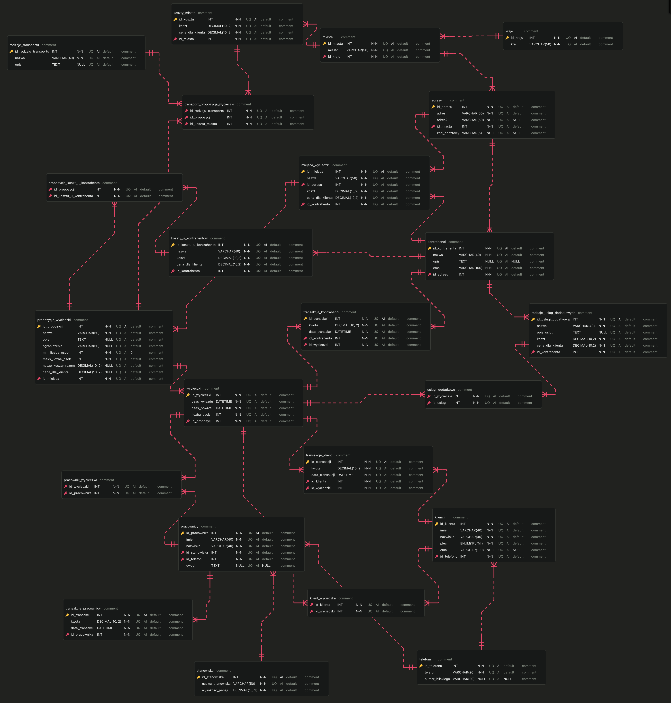

wlaczyc instalacje pakietow
```{r setup, include=FALSE}
knitr::opts_chunk$set(echo = FALSE, warning = FALSE, message = FALSE)
options(repos = list(CRAN="http://cran.rstudio.com/"))

#install.packages("RMariaDB")
#install.packages("ggplot2")
# install.packages("ggrepel")
#install.packages("lattice")
# install.packages("dplyr")
# install.packages("tidyverse")


library(lattice)
library(ggplot2)
library(ggrepel)
library(RMariaDB)
library(dplyr)
library(tidyverse)
```

```{r}
#tutaj polaczenie z baza danych i selecty
```

# Schemat


```{r, out.width="60%",  fig.align="center", fig.cap="Uproszczony schemat naszej bazy danych"}

```

```{r, out.width="60%",  fig.align="center", fig.cap="Dokładny schemat naszej bazy danych"}

```

# Analiza danych

```{r najpopularniejsze rodzaje wycieczek, fig.align="center"} 
# Moze dokladna ilosc osob ktora bbyla na kazdej z wycieczek
what <- readRenviron('../.env')
pass <- Sys.getenv("CONNECTION_PASSWORD")


con <- dbConnect(RMariaDB::MariaDB(),
                 dbname = 'team02',
                 username = 'team02',
                 password = pass,
                 host = 'giniewicz.it')


query <- "SELECT
            pw.nazwa AS Rodzaj_wycieczki,
            SUM(w.liczba_osob) AS Liczba_uczestników,
            SUM(pw.maks_liczba_osob) AS Maksymalna_liczba_uczestników,
            (SUM(w.liczba_osob) / SUM(pw.maks_liczba_osob)) * 100 AS Procent_popularności
          FROM
            wycieczki w
          JOIN
            propozycje_wycieczki pw ON w.id_propozycji = pw.id_propozycji
          GROUP BY
            pw.nazwa
          ORDER BY
            (SUM(w.liczba_osob) / SUM(pw.maks_liczba_osob)) * 100 DESC;"

df <- dbGetQuery(con, query)

# ggplot(data = df, mapping = aes(x = Rodzaj_wycieczki,y = Procent_popularności, fill = Rodzaj_wycieczki)) +
#   geom_bar(stat = 'identity', width = 0.7) +
#   theme(axis.text.x = element_blank(),
#         axis.ticks.x = element_blank())

ggplot(data = df, mapping = aes(x = reorder(Rodzaj_wycieczki, -Procent_popularności),
                                y = Procent_popularności, 
                                fill = Rodzaj_wycieczki)) +
  geom_bar(stat = 'identity', 
           width = 0.55,) +
  geom_text(label = paste0(round(df$Procent_popularności, 0), '%'),
            check_overlap = TRUE,
            nudge_y = 5) +
  scale_y_continuous(breaks = seq(from=0, to=100, by=25)) +
  ggtitle("Najpopularniejsze rodzaje wycieczek wśród naszych klientów") +
  ylab("Procent popularności") +
  xlab("Wycieczki") +
  theme(axis.text.x = element_blank(),
        axis.ticks.x = element_blank())

dbDisconnect(con)
```

```{r Porównanie kosztów i zysków wycieczek, fig.align='center'}
what <- readRenviron('../.env')
pass <- Sys.getenv("CONNECTION_PASSWORD")


con <- dbConnect(RMariaDB::MariaDB(),
                 dbname = 'team02',
                 username = 'team02',
                 password = pass,
                 host = 'giniewicz.it')

query = "WITH wplywy AS (
    SELECT tk.id_wycieczki, SUM(tk.kwota) AS suma
    FROM transakcje_klienci AS tk
    GROUP BY tk.id_wycieczki
), wydatki_nasze AS (
    SELECT
        w.id_wycieczki,
        ((km.koszt + pw.nasze_koszty_razem) * w.liczba_osob) AS nasze_koszty
    FROM
        wycieczki w
    JOIN
        propozycje_wycieczki pw ON w.id_propozycji = pw.id_propozycji
    JOIN
        transport_propozycja_wycieczki tpw ON pw.id_propozycji = tpw.id_propozycji
    JOIN
        koszty_miasta km ON tpw.id_kosztu_miasta = km.id_kosztu
), wydatki_kontrahenci AS (
    SELECT
        tko.id_wycieczki,
        SUM(tko.kwota) AS wydatki_kontrahenci
    FROM
        transakcje_kontrahenci AS tko
    GROUP BY
        tko.id_wycieczki
) SELECT
    pw.id_propozycji AS id_propozycji,
    pw.nazwa AS nazwa,
    SUM(wplywy.suma) AS Całkowite_wpływy,
    SUM(wydatki_nasze.nasze_koszty + wydatki_kontrahenci.wydatki_kontrahenci) AS Całkowite_wydatki,
    SUM(wplywy.suma) - SUM(wydatki_nasze.nasze_koszty + wydatki_kontrahenci.wydatki_kontrahenci) AS Zysk
    FROM wycieczki w
    JOIN wplywy ON w.id_wycieczki = wplywy.id_wycieczki
    JOIN wydatki_nasze ON w.id_wycieczki = wydatki_nasze.id_wycieczki
    JOIN wydatki_kontrahenci ON w.id_wycieczki = wydatki_kontrahenci.id_wycieczki
    JOIN propozycje_wycieczki pw ON w.id_propozycji = pw.id_propozycji
    GROUP BY pw.id_propozycji
    ORDER BY Zysk DESC;"

df <- dbGetQuery(con, query)

df2 <- df %>% 
  mutate(csum = rev(cumsum(rev(Zysk))), 
         pos = Zysk/2 + lead(csum, 1),
         pos = if_else(is.na(pos), Zysk/2, pos))


# ggplot(data = df, mapping = aes(x = reorder(nazwa, -Zysk),
#                                 y = Zysk,
#                                 fill = nazwa)) +
#   geom_bar(stat = 'identity',
#            width = 0.55) +
#   geom_text(label = df$Zysk,
#             check_overlap = TRUE,
#             nudge_y = 10) +
#   ggtitle("Zysk przyniesiony przez dany rodzaj wycieczki (w zł)") +
#   theme(axis.text.x = element_text(angle = 80, 
#                                    face = "bold", 
#                                    size = 10,
#                                    hjust = 0.9),
#         axis.ticks.x = element_blank(),
#         axis.title = element_blank(),
#         legend.position = 'none')

ggplot(data = df, mapping = aes(x = "",
                                y = Zysk,
                                fill = fct_inorder(nazwa))) +
  geom_col(color = 'black') +
  coord_polar(theta = 'y') +
  geom_label_repel(data = df2,
                   aes(y = pos, label = paste0(Zysk, "zł")),
                   show.legend = FALSE,
                   nudge_x = 1) +
  guides(fill = guide_legend(title = "Wycieczka")) +
  ggtitle("Zysk z każdego rodzaju wycieczki") +
  theme_void()

dbDisconnect(con)
```

```{r Najbardziej dochodowe dla nas usługi dodatkowe, fig.align='center'}
what <- readRenviron('../.env')
pass <- Sys.getenv("CONNECTION_PASSWORD")


con <- dbConnect(RMariaDB::MariaDB(),
                 dbname = 'team02',
                 username = 'team02',
                 password = pass,
                 host = 'giniewicz.it')

query = "SELECT
    rud.nazwa AS usluga_dodatkowa,
    SUM((rud.cena_dla_klienta - rud.koszt) * w.liczba_osob) AS zysk
FROM
    uslugi_dodatkowe ud
JOIN
    wycieczki w ON ud.id_wycieczki = w.id_wycieczki
JOIN
    rodzaje_uslug_dodatkowych rud ON ud.id_uslugi = rud.id_uslugi_dodatkowej
GROUP BY
    rud.id_uslugi_dodatkowej
ORDER BY
    zysk DESC;"

df <- dbGetQuery(con, query)

ggplot(data = df, mapping = aes(x = reorder(usluga_dodatkowa, -zysk),
                                y = zysk,
                                fill = usluga_dodatkowa)) +
  geom_bar(stat = 'identity', 
           width = 0.55) +
  geom_text(label = df$zysk,
            check_overlap = TRUE,
            nudge_y = 10) +
  ggtitle("Zysk przyniesiony przez dany rodzaj usługi dodatkowej (w zł)") +
  theme(axis.text.x = element_text(angle = 80, 
                                   face = "bold", 
                                   size = 10,
                                   hjust = 0.9),
        axis.ticks.x = element_blank(),
        axis.title = element_blank(),
        legend.position = 'none')

dbDisconnect(con)
```

```{r Średni procent poweracajacych klientow, fig.align='center'}
what <- readRenviron('../.env')
pass <- Sys.getenv("CONNECTION_PASSWORD")


con <- dbConnect(RMariaDB::MariaDB(),
                 dbname = 'team02',
                 username = 'team02',
                 password = pass,
                 host = 'giniewicz.it')

query = "SELECT
    w.id_wycieczki,
    w.id_propozycji,
    pw.nazwa,
    w.czas_wyjazdu,
    w.czas_powrotu,
    COUNT(DISTINCT k.id_klienta) AS Liczba_klientów,
    COUNT(DISTINCT CASE WHEN k.id_klienta IN (
        SELECT
            kw2.id_klienta
        FROM
            klient_wycieczka kw2
        WHERE
            kw2.id_wycieczki != w.id_wycieczki
    ) THEN k.id_klienta END) AS Liczba_powracajacych_klientow,
    (COUNT(DISTINCT CASE WHEN k.id_klienta IN (
        SELECT
            kw2.id_klienta
        FROM
            klient_wycieczka kw2
        WHERE
            kw2.id_wycieczki != w.id_wycieczki
    ) THEN k.id_klienta END) / COUNT(DISTINCT k.id_klienta)) * 100 AS Procent_powracających_klientów
FROM
    wycieczki w
JOIN
    klient_wycieczka kw ON w.id_wycieczki = kw.id_wycieczki
JOIN
    klienci k ON kw.id_klienta = k.id_klienta
JOIN
    propozycje_wycieczki pw ON w.id_propozycji = pw.id_propozycji
GROUP BY
    w.id_wycieczki
ORDER BY
    Liczba_powracajacych_klientow DESC;"

df <- dbGetQuery(con, query)

df2 <- df %>%
  group_by(nazwa) %>%
  summarise(procent = mean(Procent_powracających_klientów, na.rm = TRUE))


ggplot(data = df2, mapping = aes(x = reorder(nazwa, -procent),
                                y = procent,
                                fill = nazwa)) +
  geom_bar(stat = 'identity', 
           width = 0.55) +
  geom_text(label = round(df2$procent, 0),
            check_overlap = TRUE,
            nudge_y = 10) +
  scale_y_continuous(breaks = seq(from=0, to=100, by=25)) +
  ggtitle("Procent powracających klientów po danej wycieczce") +
  theme(axis.text.x = element_text(angle = 80, 
                                   face = "bold", 
                                   size = 10,
                                   hjust = 0.9),
        axis.ticks.x = element_blank(),
        axis.title = element_blank(),
        legend.position = 'none')

dbDisconnect(con)
```
# Podsumowanie

 


